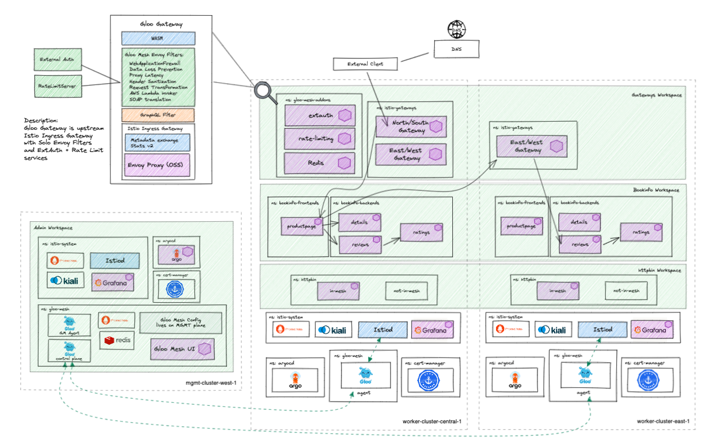
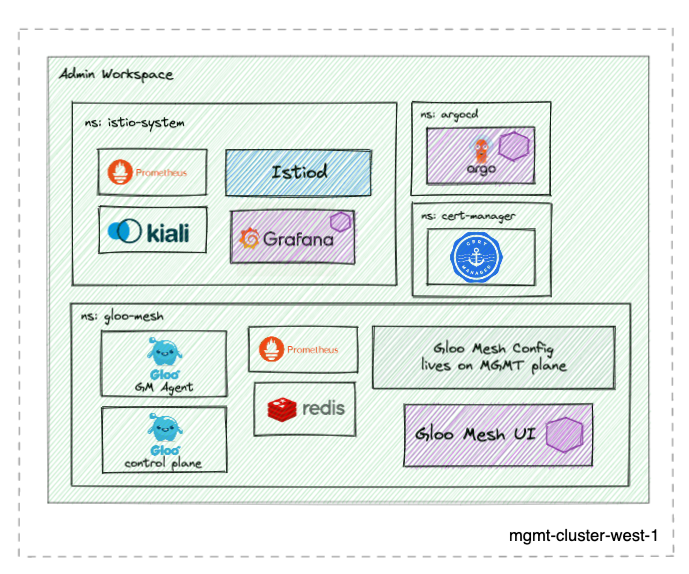
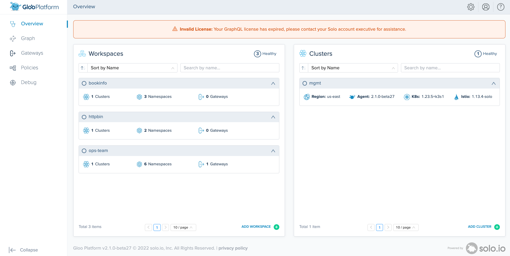
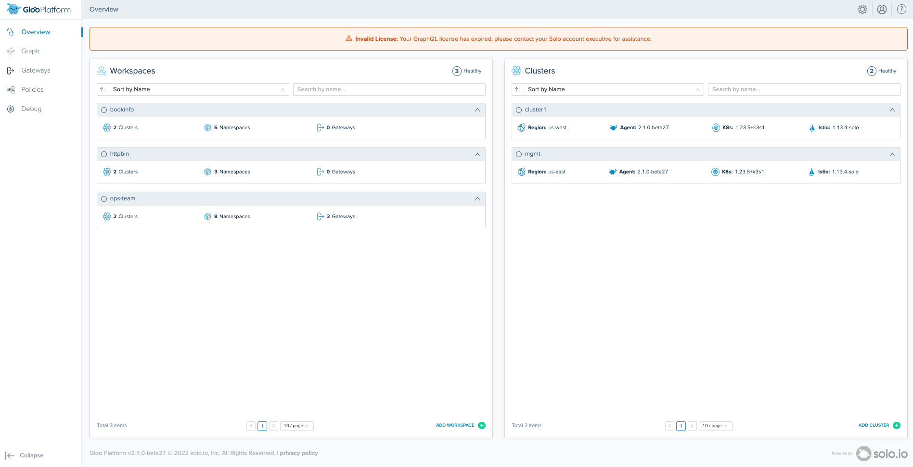

# aoa-mgmt
This repo provides a multitenant capable GitOps workflow structure that can be forked and used to demonstrate the deployment and configuration of a multi-cluster mesh demo as code using the Argo CD app-of-apps pattern.

# versions
- prod:
    - gloo mesh 2.1.0-rc1
    - istio 1.13.4
    - revision: 1-13
- dev:
    - gloo mesh 2.1.0-rc2
    - istio 1.15.0
    - revision: 1-15

# Prerequisites 
- 1 Kubernetes Cluster
    - This demo has been tested on 1x `n2-standard-4` (gke), `m5.xlarge` (aws), or `Standard_DS3_v2` (azure) instance for `mgmt` cluster

This repo is meant to be deployed along with the following repos to create the entire High Level Architecture diagram below.
- https://github.com/ably77/aoa-cluster1
- https://github.com/ably77/aoa-cluster2

# High Level Architecture


# What this repo deploys


# Getting Started
This repo uses git submodules, so run the following command if contents of `aoa-tools` are missing
```
git submodule update --init
```

Run:
```
./aoa-tools/deploy-mgmt.sh $LICENSE_KEY $environment_overlay $cluster_context       # deploys on mgmt cluster by default if no input
```
The script will prompt you for input if not provided

## Variables
You can configure parameters used by the script in the `vars.txt`. This is particularily useful if you want to test an alternate repo branch or if you fork this repo.
```
LICENSE_KEY=${1:-""}
environment_overlay=${2:-""} # prod, dev, base
cluster_context=${3:-mgmt}
github_username=${4:-ably77}
repo_name=${5:-aoa-mgmt}
target_branch=${6:-HEAD}
```

Note:
- Although you may change the contexts where apps are deployed as describe above, the Gloo Mesh and Istio cluster names will remain stable references (i.e. `mgmt`, `cluster1`, and `cluster2`)

## Log in to the Gloo Mesh and Argo CD UI
Once the installation is complete, you should be able to navigate to your LoadBalancer address to access Argo CD and the Gloo Mesh UI. The `bookinfo`, `httpbin`, and `ops-team` workspaces have already been precreated as well as the `mgmt` cluster and agent registered. 



### Gloo Mesh UI through the Istio Ingressgateway
This setup is configured to expose the Gloo Mesh UI with Gloo Gateway using a wildcard host '*'. This means when using the default type LoadBalancer setting, this will take the address of the generated load balancer for the Istio ingressgateway

To access the Gloo Mesh UI you can go to https://< istio-gateway-address >/gmui

#### Gloo Mesh UI using port-forwarding
You can also always use port-forward
```
kubectl port-forward -n gloo-mesh svc/gloo-mesh-ui 8090
```

### Argo UI through the Istio Ingressgateway
This setup is configured to expose ArgoCD using a wildcard host '*' at the endpoint `/argo`. This means when using the default type LoadBalancer setting, this will take the address of the generated load balancer for the Istio ingressgateway

To access the Argo CD UI you can go to https://< istio-gateway-address >/argo

Login to Argo CD with:
Username: admin
Password: solo.io

#### Argo UI with port-forwarding
access the argocd dashboard with port-forward:
kubectl port-forward svc/argocd-server -n argocd 9999:443 --context mgmt

navigate to http://localhost:9999/argo in your browser for argocd

username: admin
password: solo.io

# What's Next?
At this point, the base setup for a single cluster mesh is complete. It is possible now to deploy your own workloads in application namespaces and create Gloo Mesh CRDs and policies manually, or if you have forked this repo you can push those updates into Git and let Argo CD sync those changes for you.

## Multi Cluster
As noted above, this repo is meant to be deployed along with the following repos to create the entire multi-cluster architecture. When successfully deployed together, you will see that the Gloo Mesh Agent will register itself to the control plane and the `bookinfo` and `httpbin` workloads that exist on `cluster1` and `cluster2` (if also deployed) will be routable destinations in the mesh. 
- https://github.com/ably77/aoa-cluster1
- https://github.com/ably77/aoa-cluster2



# App of Apps Explained
The app-of-apps pattern uses a generic Argo Application to sync all manifests in a particular Git directory, rather than directly point to a Kustomize, YAML, or Helm configuration. Anything pushed into the `environment/<overlay>/active` directory is deployed by it's corresponding app-of-app

If you are curious to learn more about the pattern, Christian Hernandez from CodeFresh has a solid blog describing at a high level the pattern I'm using here in this repo
(https://codefresh.io/blog/argo-cd-application-dependencies/)

# forking this repo
Fork this repo and replace the variables in the `vars.txt` github_username, repo_name, and branch with your own

From there should be able to deploy and sync the corresponding `environment` waves as is in your forked repo or push new changes to it